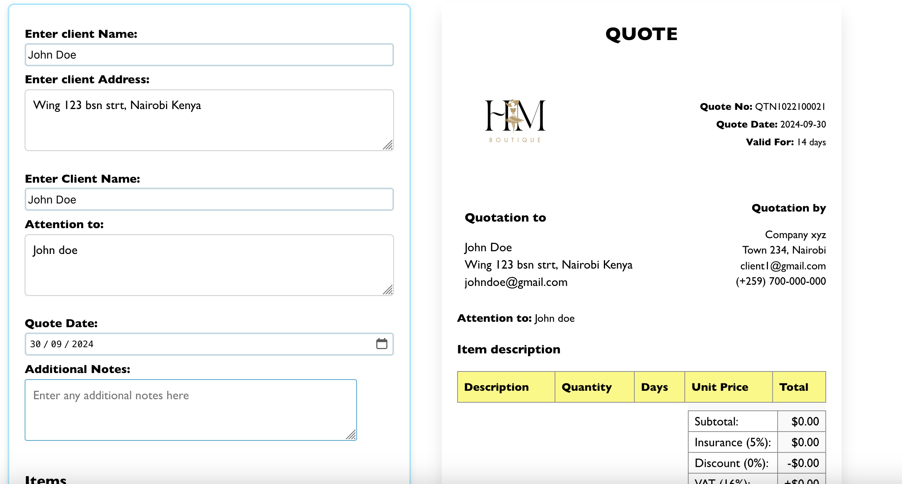

# About Quotationer_demo 

## Usage
1. Has both quote generator and invoice generator.
2. Forms to enter client details on both pages. 
3. Input for date. 
4. Customized bank details depending on what currency payment is involved, options are ksh and dollar.
5. Create invoice/quote table - add, edit and remove items from your table.
6. Discount drop down that reflects on the preview side, options from 0% to 50% discount.
7. Write additional notes to your client such as how to pay or anything important information to note.
8. 5% insurance addition integrated.
9. 16% VAT integrated.
10. Preview of documents available.
11. Print your invoice/quote as pdf.
12. Contact, help or report bug page available on help page.

## Updates done

## To dos: future improvements
1. Better log in experience.
2. Cookies functionality.
3. Validation chcks for the inputs.

## Contributing

Kindly report any issues, submit feature requests. However do not make live adjustments to my code(credit will be given with reports and feature recommendations).

## License

N/A

## Authors

Lorna Ombati(Me)

## Note

Please note that there is a live version available that is being used by a client and any attempt to duplicate this project may be copyright infringement violations.

## Copyright

© 2024 Lorna Ombati. All rights reserved.

